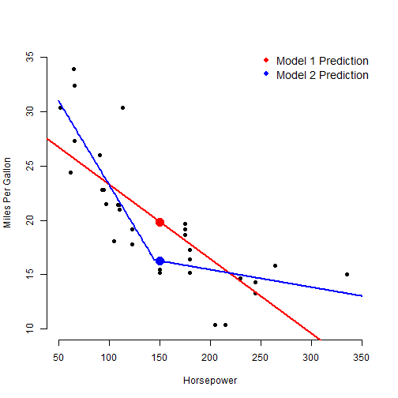

Developing Data Products: Using MPG to Predict Horsepower
========================================================
author: Phil Renner
date: 12/29/2021
autosize: true

Background
========================================================

Sometimes, when we are designing a car we know the horsepower of the engine and need to know what the miles per gallon are likely to be. To help with that task, I designed a Shiny app to use the horsepower to predict MPG.


Predicting MPG
========================================================
We built two models to predict MPG from horsepower, and used a slider to select horsepower and check boxes to select which models to display, as shown below. See the next 2 slides for the code used




Predicting MPG - The Code
========================================================
This is the code used to produce the graph


```r
 mtcars$hpsp <- ifelse(mtcars$hp - 145 > 0, mtcars$hp - 145, 0)
    model1 <- lm(mpg ~ hp, data = mtcars)
    model2 <- lm(mpg ~ hpsp + hp, data = mtcars)
   hpInput <- 150
      model1pred <- predict(model1, newdata = data.frame(hp = hpInput))
      model2pred <- predict(model2, newdata = 
                    data.frame(hp = hpInput,
                               hpsp = ifelse(hpInput - 145 > 0,
                                              hpInput - 145, 0)))
```


Predicting MPG - The Code (continued)
========================================================


```r
#    output$plot1 <- 
            plot(mtcars$hp, mtcars$mpg, xlab = "Horsepower", 
             ylab = "Miles Per Gallon", bty = "n", pch = 16,
             xlim = c(50, 350), ylim = c(10, 35))
            abline(model1, col = "red", lwd = 2)
            points(hpInput, model1pred, col = "red", pch = 16, cex = 2)
            model2lines <- predict(model2, newdata = data.frame(
                hp = 50:350, hpsp = ifelse(50:350 - 145 > 0, 50:350 - 145, 0)))
            lines(50:350, model2lines, col = "blue", lwd = 2)
            points(hpInput, model2pred, col = "blue", pch = 16, cex = 2)
        legend("topright", c("Model 1 Prediction", "Model 2 Prediction"), pch = 16, 
               col = c("red", "blue"), bty = "n", cex = 1.2)
```

Data Set
========================================================
The app uses the Motor Trend cars data in the mtcars dataset.


```r
head(mtcars)
```

```
                   mpg cyl disp  hp drat    wt  qsec vs am gear carb hpsp
Mazda RX4         21.0   6  160 110 3.90 2.620 16.46  0  1    4    4    0
Mazda RX4 Wag     21.0   6  160 110 3.90 2.875 17.02  0  1    4    4    0
Datsun 710        22.8   4  108  93 3.85 2.320 18.61  1  1    4    1    0
Hornet 4 Drive    21.4   6  258 110 3.08 3.215 19.44  1  0    3    1    0
Hornet Sportabout 18.7   8  360 175 3.15 3.440 17.02  0  0    3    2   30
Valiant           18.1   6  225 105 2.76 3.460 20.22  1  0    3    1    0
```


For More Information
========================================================

Shiny App:  https://rennerpmr.shinyapps.io/DDPFinal2/

Github: https://github.com/rennerpmr/DDPFinal2
